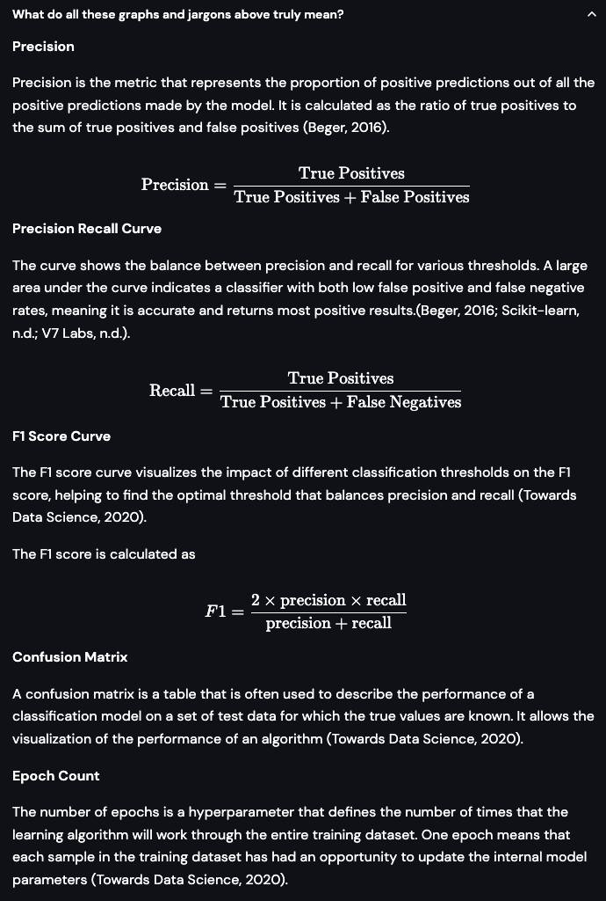

# Glossary / Jargons

Scrolling at the end of the page you can find an expander that contains the terms that are visible within the app.

<figure><figcaption>
Glossary Section of the app
</figcaption></figure>

<figure><figcaption>
Glossary Section
</figcaption></figure>

License:

MIT License for the Icon used from thenounproject is credited.

References:&#x20;

The references are put up in Harvard Format
