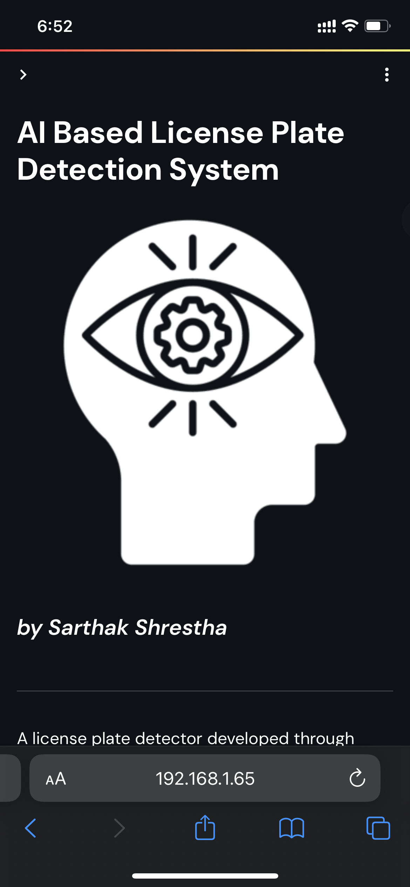
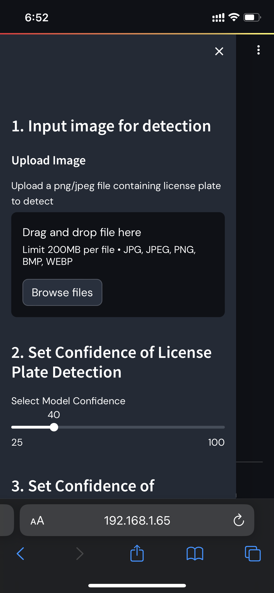

# Streamlit for Deployment

The post models were put into Streamlit which is a Python Framework that helps in deploying and showcasing ML technologies. For this instance I have utilized it for creating the AI based license plate detection system.&#x20;

<figure><figcaption>
File Structure of the Streamlit app
</figcaption></figure>

After running locally on the machine, it can be used both on mobile and the web as well.

<figure><figcaption>
Locally running the web-app on a laptop
</figcaption></figure>

<figure><figcaption>
Running the web-app on a mobile (1)
</figcaption></figure>

<figure><figcaption>
Sidebar on the mobile web-appp
</figcaption></figure>

The model will then be officially deployed on Streamlit's official deployment web app.

Preparing for deployment through: share.streamlit.io

<figure><figcaption>
Added App for deployment
</figcaption></figure>

Trying to deploy the app:

<figure><figcaption></figcaption></figure>

Successful deployment on the second try by fixing dependencies and error:

<figure><figcaption>
Voila, and finally the model is deployed
</figcaption></figure>

